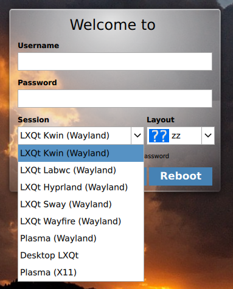
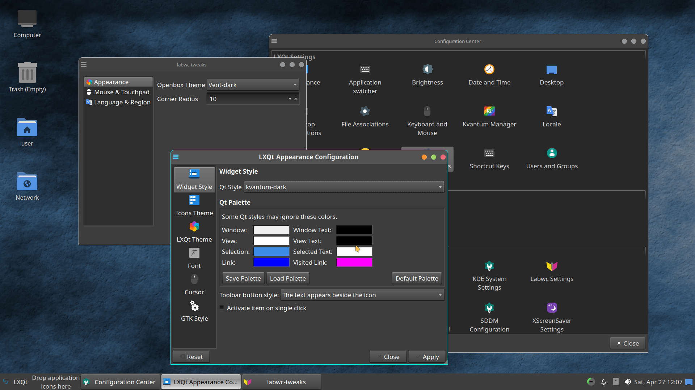
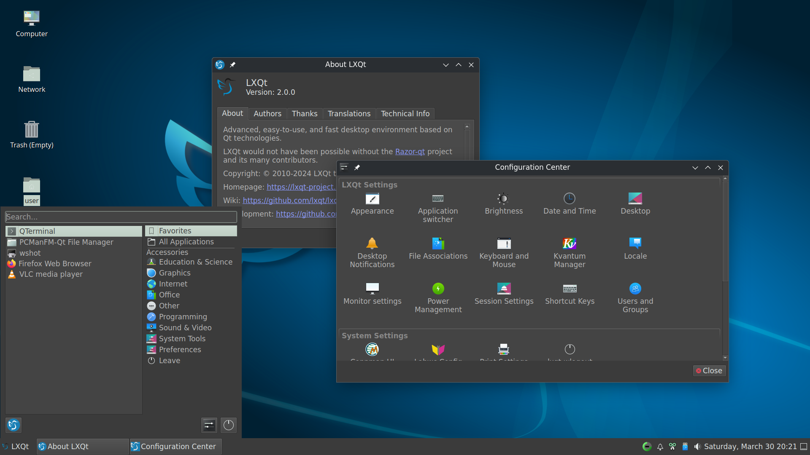
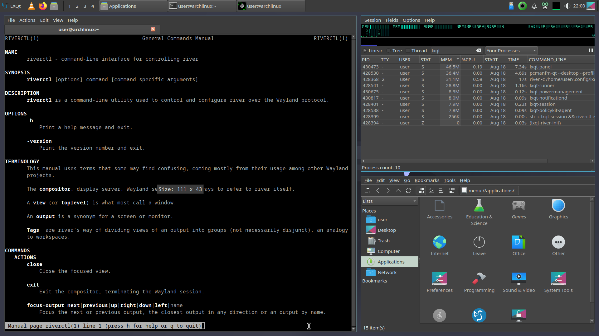
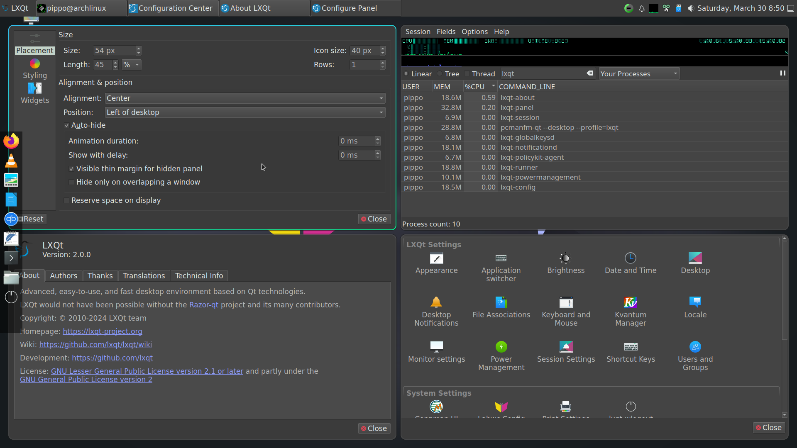

# LXQt Desktop under Wayland

> General files and dotfiles for a LXQt Wayland session. LXQt 2.0 has native wayland support
in all its elements now but some features are not ready yet.

<p align="center" width="100%">
    
</p>


### Folder/Content

* `start_scripts`: `startlxqt<compositor>` : ENV variables, import settings, start compositor
* `wayland-sessions`: `<compositor>_lxqt.desktop` : Entry in SDDM
* `scripts`: some tools for autostart and else
* `config` : configurations for LXQt < 2.0 and other components
* `AUR` : PKGBUILD for lxqt-panel

### lxqt-panel

* Working in labwc, sway, hyrpland, kwin_wayland, wayfire, river and most probably with all wroots based compositors.
Until LXQt v2.1 comes out compiling is needed using git checkouts:

  * [Wlroots-based compositors + kwin](https://github.com/stefonarch/lxqt-panel/tree/wayland_panel)  (PKGBUILD  available in [AUR folder](./AUR)). Note: desktop switcher under kwin_wayland is broken atm.

  * [kwin_wayland only](https://github.com/lxqt/lxqt-panel/tree/work/gfgit/wayland_taskbar).

For more details and workarounds see [lxqt-panel](lxqt-panel.md) page.

## Starting LXQt Session

* Copy the desired file(s) from `wayland-sessions` to `/usr/share/wayland-sessions/` (if using a display manager like SDDM). Copy the desired scripts from `startup_scripts` to `/usr/bin/` or `/usr/local/bin` and make them executable.

* Labwc and kwin_wayland start scripts will start `lxqt-session` automatically; in other compositors executing
`lxqt-session` or some of its components has to be configured in their settings file. For both complete installation
setups are available, see "Screenshots" below. To exit also the compositor after exiting LXQt  `&& <exit_command>` should be used.
* `startlxqt<compositor>` scripts can be executed also directly in tty.

* `$XDG_CURRENT_DESKTOP` is now set to `LXQt:<compositor` including also `:wlroots` if not kwin-wayland.
* Basically similar script could work for any compositor, see their last line.
* The provided startup scripts use the default configuration files for the compositors. All wlroots-based compositors have options to use different location if different settings are desired.

#### Notes and News

* Multiple user session are possible alongside a normal session started by sddm by simply login on tty and using one of the [start scripts](https://github.com/stefonarch/LXQt-Wayland-files/tree/main/start_scripts). Screenlocking is not handled though. Using `kwin_wayland` multiple user sessions are fully supported.
* Module`lxqt-globalshortcuts`  loads but cannot register shortcuts on wayland. Global shortcuts are handled by the compositor only.
* Some applications in autostart may not work under wayland and/or can cause high cpu usage - see "scripts" folder for a selective autostart of applications depending on session type x11/wayland. For wayland-only applications useing the autostart settings from the compositor is recommended.
* Qterminal's dropdown mode is supported now in git. Adding manually a hotkey for `qterminal -d` in compositor settings is needed.
* LXQt screenlock settings are supported now in wayland with `liblxqt-git`. Using `kwin_wayland` screenlocking is provided by the compositor while `swaylock`, `waylock`and `hyprlock` can be used in wlroots-based compositors.
In `~/.config/lxqt/session.conf`:

```
[General]
__userfile__=true
...

lock_command=slock
lock_command_wayland=swaylock

```
For kwin_wayland the setting is `loginctl lock-session`.

## Screenshots and Annotations

### Labwc (stacking)



See: [lxqt-labwc-session](https://github.com/stefonarch/lxqt-labwc-session).

### Kwin_wayland (stacking)



See [lxqt-kwin-session](https://github.com/stefonarch/lxqt-kwin-session).

### Wayfire (stacking)

Basic settings in `wayfire.ini`:

```
[autostart]
autostart_wf_shell = false
background = swaybg -i /usr/share/lxqt/wallpapers/origami-dark.png
lxqt_session = lxqt-session && killall wayfire

[command]
command_launcher = lxqt-runner
binding_launcher = <alt> KEY_SPACE
```
Exists a configation GUI tool WCM (wayfire configuration manager).
In wayfire 0.8.1 `lxqt-runner` doesn't get focus automatically.

### Sway (tiling)

Basic Settings:

```
exec lxqt-session && sway exit

for_window [app_id="^lxqt-.*$"] floating enable
for_window [app_id="^lxqt-.*$"] floating enable

bindsym alt+space exec lxqt-runner
```
In sway 1.9 `lxqt-runner` and qterminal's dropdown don't get keyboard focus automatically.

### River (tiling)



The taskbar of `lxqt-panel` is most useless in river as it can't focus tags except when on tag 0, so lxqt-panel v.2.0 is fine.
"Custom Command Plugin" allows building a tag switcher in the panel and much more.

Basic Settings:

```
riverctl spawn "lxqt-session && riverctl exit"

# Powerbutton
for mode in normal
do
    riverctl map $mode None XF86PowerOff spawn lxqt-leave
done

```

### Hyprland (tiling)



Basic settings needed in `hyprland.conf`:

```
monitor=,preferred,auto,1

env = QT_QPA_PLATFORMTHEME,lxqt
env = QT_PLATFORM_PLUGIN,lxqt
env = XDG_MENU_PREFIX,lxqt-
env = XDG_CURRENT_DESKTOP,LXQt:Hyprland:wlroots

exec-once=lxqt-session && hyprctl dispatch exit


windowrule = float,^(lxqt-.*)$
windowrule = float,^(pavucontrol-qt)$
windowrule = float,^(sddm-conf)$
windowrule = float,^(pcmanfm-qt)$
windowrule = float,copyq
```

###  3rd party tools

* `swaybg` : background image (below desktop)
* `swayidle; swaylock` :  lock screen
* Panels/bars:
* `sfwbar` : [Source](https://github.com/LBCrion/sfwbar) taskbar and much more
* `yatbfw` [Source](https://github.com/selairi/yatbfw): taskbar, clock, quicklaunch
* `waybar` : taskbar, notification area, cpu/#windowrule = float,^(cmst)$
windowrule = float,io.github.martinrotter.rssguardram/temp monitor, keyboard layout display
For `keyboard-state` working make sure your user is member of the "input" group. Some icons need "font-icon" and "font-awesome" to be displayed.
* `wlrctr` and `wtype` : for some keybindings  - especially open applications menu in `lxqt-panel`
* `wdisplay`: Screen management GUI, see [wdisplay](https://github.com/artizirk/wdisplays)
* `clipman`, `dmenu`, `wl-clipboard` : cliboard manager (configuration see `wayfire.ini`)
* `grim`,`slurp` : screenshots [Example configuration](https://github.com/stefonarch/LXQt-Wayland-files/blob/3a7f36c8945eee874a5111ea3a425edbc7da9034/wayfire/wayfire.ini#L240)
* `wshot` GUI for screenshots, see [wshot](https://github.com/qtilities/wshot)
* `wev` : xev for wayland
* wayfire plugin for [per application keyboard layout switch](https://github.com/AlexJakeGreen/wayfire-kbdd-plugin)
* `gammastep` replacement for redshift
* `wvkbd` virtual keyboard


### Tipps and Tricks

* Swipe to change workspace `~/.config/libinput-gestures.conf` (for shortcuts "C-A-left|right" in labwc)

```
gesture: swipe left 3	wtype  -M ctrl -M alt -P right
gesture: swipe right 3 wtype  -M ctrl -M alt -P left
```

Using Sway `swaymsg`can be used:
```
gesture: swipe left 3   swaymsg -t command workspace next_on_output
gesture: swipe right 3  swaymsg -t command workspace prev_on_output
```
Add `libinput-gestures-setup start ` to autostart.

* Screensaver:

In `autostart`:

`swayidle before-sleep swaylock timeout 300 'feh -rzsZFD 8  --draw-exif --draw-tinted ~/path/to/folder' resume 'killall feh'`

* Dim inactive windows: see `scripts`.

* Exit gently also applications started by shortcut by the compositor when exiting `lxqt-session`.
 Example for labwc:

```  
    <keybind key="W-k">
      <action name="Execute" command="pcmanfm-qt '/usr/share/applications/org.keepassxc.KeePassXC.desktop'" />
    </keybind>
```

* Featherpad single window doesn't focus if already open: copy `featherpad.desktop` from `/usr/share/applications` to to `~/.local/share/applications` and changed the line

```
Exec=bash -c "featherpad %U && wlrctl window focus featherpad"
```


* Telegram does not open multimedia files

If images and video do not open: unset "animation" and eventually "opengl" in `Preferences > Advanced`.


