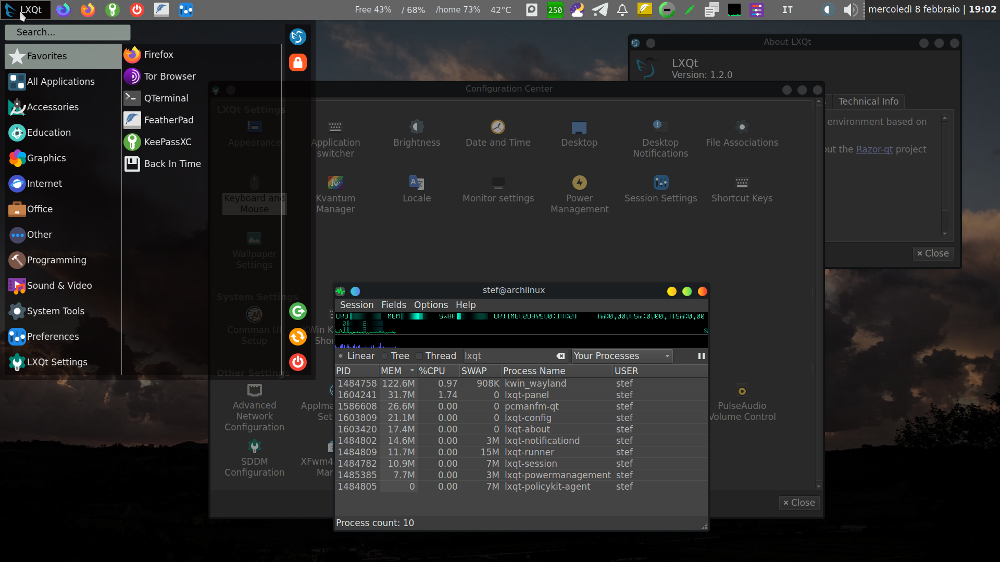
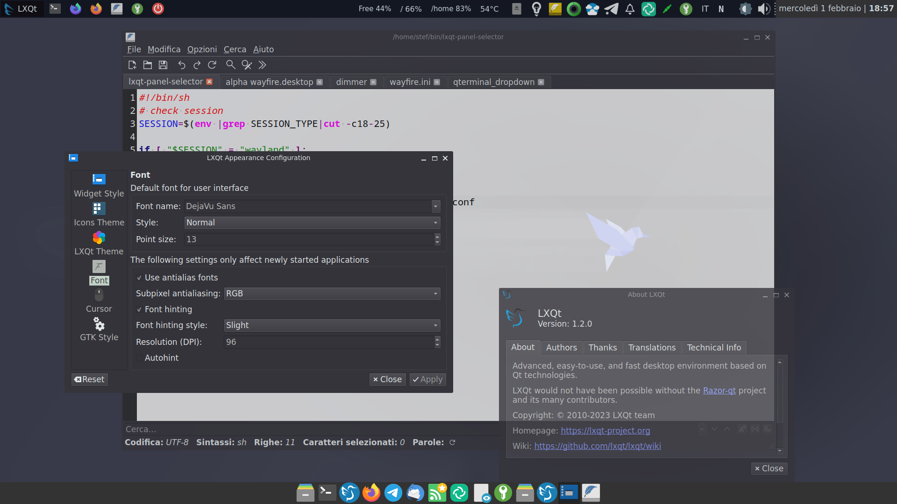
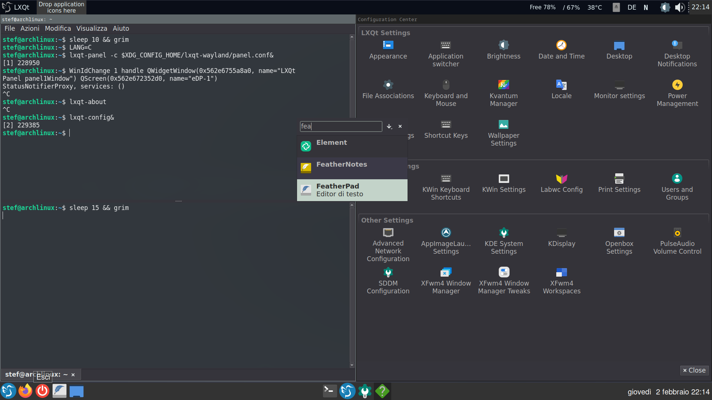
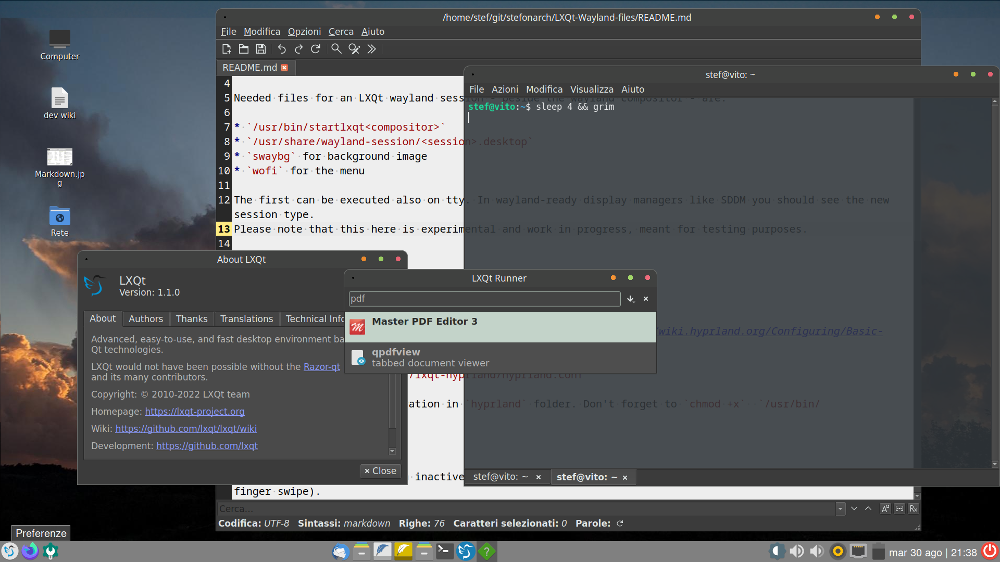
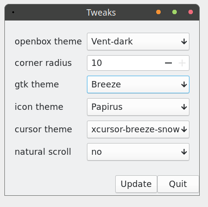
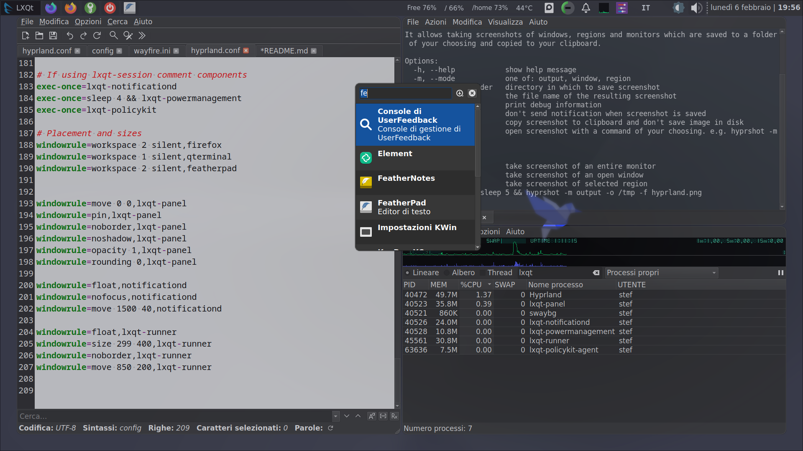

# Wayland Implementations for the LXQt Desktop

> Files and dotfiles for a LXQt Wayland session. LXQt hasn't implemented yet wayland protocols but many components are full or partially working on wayland natively.

* `/usr/bin/startlxqt<compositor>` : ENV variables, import settings, start compositor
* `/usr/share/wayland-session/<compositor>_lxqt.desktop` : Entry in SDDM
* `swaybg` : background image
* `swayidle; swaylock` : idle settings, lock screen
* `yatbfw` : taskbar, clock, quicklaunch
* `waybar` : notification area, cpu/ram/temp monitor, keyboard layout display
* `lxqt-wlogout` : Close session, see [lxqt-wlogout](https://github.com/stefonarch/lxqt-wlogout)
* `wmctrl` : for some keybindings
* `wdisplay`: Screen management GUI, see [wdisplay](https://github.com/artizirk/wdisplays)
* `scripts` and `autostart`: some tools  for autostart and else


## Starting LXQt Session

Copy the `lxqt-wayland` folder to `~/.config/`. It contains the default settings for the compositors and an extra part for LXQt. The `startlxqt*` scripts will use the configuration in this location; copy the desired file(s) from `wayland-sessions` to `/usr/share/wayland-sessions/` (if using a display manager like SDDM to choose sessions). Copy the desired scripts from `startup_scripts` to `/usr/bin/` or `/usr/local/bin` and make them executable.

`startlxqt<compositor>` scripts can be executed also directly in tty; environment variables are set here before starting the compositor.


### Working LXQt components:

`lxqt-config`, `lxqt-notificationd`, `lxqt-runner`, `lxqt-config`, `lxqt-policykit-agent`, `lxqt-powermanagement`, `PCmanFm-qt`,`LXimage-qt`, `lxqt-archiver`, `QTerminal`,`Qps` `lxqt-about` - all running natively. For `lxqt-panel` see [#lxqt-panel](https://github.com/stefonarch/LXQt-Wayland-files#lxqt-panel).

### Using lxqt-session in general

With LXQt 1.2.0  `lxqt-session` can be started in the autostart section of any compositors configuration files. For `kwin_wayland` the `startlxqtkwin` script will start the session.

* Systray/Notification area (using waybar or lxqt-panel) should start first (= `sleep 2 && lxqt-session`) (fixed in git)
* Module`lxqt-globalshortcuts`  loads but  fails to register shortcuts
* Some applications in autostart may not work under wayland and/or can cause high cpu usage - see "autostart" and "scripts" folder for a selective autostart of applications depending on session type.
* Lock settings are not applied in wayland. Uncheck "Lock screen on resume" - otherwise the process will crash on resume (but not the session) and logout and module management will not work anymore.

## Kwin_wayland (stacking)



The most similar to a LXQt x11 session, specially if already used with kwin. Needs some window rules for top/left panel, runner, notifications (import `kwin_wayland.rule` in KDE settings → Windowmanagement → Window rules).

#### Highlights

* Working desktop on all outputs, always at bottom (this needs `pcmanfm-qt` compiled with title for it's desktop window. Note: a better method needed as the rule will apply to all window with that title)
* Lock screen
* Multiple sessions/switch user (to test)
* Spectacle screenshots working
* klipper for clipboard
* `lxqt-config-monitor`  working (to test multihead)
* no manual config files editing

#### Issues

* Taskbar only provided by swaybar, yatbfw segfaults
* Same [issues to configure](https://github.com/lxqt/lxqt/wiki/ConfigWindowManagers#kwin) shortcuts when no full plasma-desktop is installed
* QTerminal crashes when try to split (only on kwin_wayland)(fixed in git)
* fullscreen window titlebar goes under the panel
* Element (xwayland) segfaults // xwayland not enabled?
* wlsunset and gammastep not working, `kcmshell5 kcm_nightcolor&` works.
* window rules for applications on workspaces doesn't work
* keys for brightness and volume are not working (sliders from panel work)


## Wayfire (stacking)



[Source](https://github.com/WayfireWM/wayfire/wiki/Configuration), [docs](https://github.com/WayfireWM/)

Very usable stacking compositor for a traditional LXQt experience: notifications, lxqt-runner, pcmanfm-qt,
multiple desktops and lxqt-panel with some limits and quirks do work. In addition many resource-friendly desktop effects and animations. Using git version `0.8.0-*` is recommended.

#### PCmanFm-qt Desktop configuration

 `pcmanfm-qt --desktop` works perfectly with `wayfire-extra-plugins-git/background_view` enabled and this setting:

```
[background-view]
command = pcmanfm-qt --desktop
app_id = pcmanfm-qt
inhibit_input = false
```
Its module in `lxqt-session` will not work and can be disabled.

#### Issues

* `lxqt-notificationd` steals focus (solved in `wayfire-extra-plugins-git/focus_steal_prevent`)
* With yatbfw and lxqt-panel in fullscreen both are visible (middle click on the icon to close lxqt-panel)
* Using CDS (client side decoration) Qt windows with the default Qt decoration will shrink atr every reload, therefor SSD is recommended

## Sway (tiling)



Configured with panels and lxqt-runner (alt+space),2 keyboard layouts (toggle: alt+shift) and some window rules.
Quite usable. See also [LXQt Sway](https://github.com/selairi/lxqt-sway).

* Mouse gestures (swipe to switch desktop): `~/.config//libinput-gestures.conf`
```
gesture: swipe left 3   swaymsg -t command workspace next_on_output
gesture: swipe right 3  swaymsg -t command workspace prev_on_output
```
See `autostart/sway_scripts.desktop`.


#### Issues


## Labwc (stacking)




[Source](https://github.com/labwc/labwc#readme), [Docs](https://labwc.github.io/index.html)

Old openbox in modern wayland clothing. Usable LXQt components are `lxqt-session`,`-powermanagement`,`-policykit`, `-runner`, `-config` and `pcmanfm-qt`.

* openbox themes in `~/.local/share/themes`

A minimal editor for rc.xml is [labwc-tweaks](https://github.com/labwc/labwc-tweaks).

.

#### Issues

* No window rules with version 0.6 for workarounds so `lxqt-panel` is not really usable (manual placement)
* `lxqt-notificationd` window steals focus and has title bar
* `lxqt-runner` and others have title bar

### Hyprland (tiling)



[Source](https://github.com/hyprwm/Hyprlasettingsnd#readme), [Wiki](https://wiki.hyprland.org/Configuring/Basic-Config/)

Nice window effects like dim inactive, fading and other animations, opacity, desktop swipe gesture (3 finger swipe). Usable LXQt components are `lxqt-panel`,`-powermanagement`,`-policykit`, `-runner`, `-config`, `-notificationd` and with a workaround `lxqt-session` (see below).

### Useful tools

* [different keyboard layout per application ](https://github.com/MahouShoujoMivutilde/hyprland-per-window-layout)
* `hyprshot` Screenshots
* `hyprpicker` (colorpicker)
*
#### Issues

* `lxqt-session` doesn't load session modules because Hyprland overwrites `XDG_CURRENT_DESKTOP=LXQt` with `XDG_CURRENT_DESKTOP=Hyprland`. Modules can be inserted manually with some delay in `hyprland.conf` or the `.desktop` files of the modules can be copied from `/etc/xdg/autostart/` to `~/.local/share/applications/` and then `OnlyShowIn=LXQt;` has to be removed.

## Panels

### lxqt-panel

`lxqt-panel` starts if no "Desktop switcher" plugin is present in its configuration file. Recommended is using `lxqt-panel -c /path/to/alternative/panel.conf`. Positioning, taskbar and a few other plugins do not work. For a working configuration with a replacement for kbindicator-plugin see  `lxqt-wayland/panel.conf`.

* Window rules needed:
  * position 0 0; # only top and left panels are usable.
  * Sticky|pin (on all desktops)
  * stay on top
  * No border/title
* Smaller width than 100% can lead to issues
* Usable in sway, hyrpland, kwin_wayland and wayfire
* custom command plugin can show/use commands from `hyprctl` and `swaymsg`, like display workspace name/switch.
* Panel volume popup opens at 0,0 (already fixed in git)
* Space on screen can be reserved by `panelspace.py` on hyprland, sway and wayfire; a full version is `lxqt-panel-loader.py` which reads its width from `panel.conf`, reserves the space needed on top and starts the panel.


### Yatbfw

[Source](https://github.com/selairi/yatbfw)

See `lxqt-wayland/yatbfw.json`.

#### Features

* taskbar/dock (close on middle click, toggle maximize on click, minimize on right click)
* launchers
* brightness and speakers
* clock


### Waybar

See `waybar` folder and config; used for systray/notification area, cpu/ram/temp/disk/keyboard-state.

For `keyboard-state` working make sure your user is member of the "input" group.

Some icons need "font-icon" and "font-awesome" to be displayed.

## Accessories

* `clipman`, `dmenu`, `wl-clipboard` : cliboard manager (configuration see `wayfire.ini`)
* `grim`,`slurp` : screenshots [Example configuration](https://github.com/stefonarch/LXQt-Wayland-files/blob/3a7f36c8945eee874a5111ea3a425edbc7da9034/wayfire/wayfire.ini#L240)
* `wf-info` : get window information for creating window rules (wayfire only)
* `wofi` alternative launcher
* `wcm` Wayfire configuration editor GUI (GTK). **Not** recommended if you also edit manually `wayfire.ini`.
* `wf-dock` dock/taskbar
* `wev` : xev for wayland
* wayfire plugin for [per application keyboard layout switch](https://github.com/AlexJakeGreen/wayfire-kbdd-plugin)
* `gammastep` replacement for redshift


## Main overall issues in compositors:

* Window activation on clicks from other windows or notifications
Fixed for browser in [Tipps & Tricks](https://github.com/stefonarch/LXQt-Wayland-files#tipps--tricks).
* Applications activated by shortcuts are not handled by `lxqt-session --logout` and therefor not gracefully closed.

## Tipps & Tricks

### Activate browser window on links clicked

Example for Firefox, similar approach should work for all browser:

Executable `/usr/bin/firefox_wayland`:
 ```
#!/bin/sh
wlrctl toplevel focus firefox
exec /usr/lib/firefox/firefox "$@"
```

Copy  `firefox.desktop` file from  `/usr/share/applications/` to  `~/.local/share/applications/` :

```
#Exec=/usr/lib/firefox/firefox %u
Exec=/usr/bin/firefox_wayland %u
```

### Autostart scripts and .desktop files

If `lxqt-session` is used scripts that select the application to launch depending of `XDG_SESSION_TYPE` or `$wayland_compositor` can be useful. Examples in `autostart` folder.

### Telegram does not open multimedia files

If images and video do not open: unset "animation"" and eventually "opengl" in `Preferences > Advanced`.


